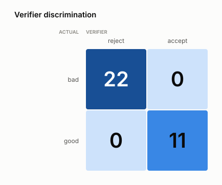
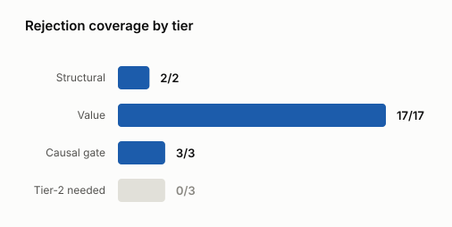
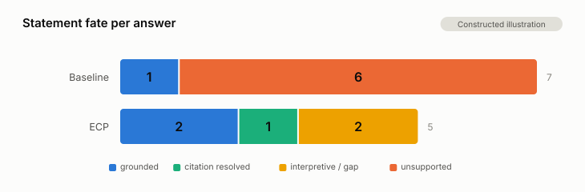

# ECP — a post-tool verification runtime for agentic systems

**Your agent's tool results are real. Its final answer may not be.**

ECP sits between tool execution and answer generation: the model writes
**structured claims**, a deterministic verifier checks them against an
**evidence store**, failed claims are repaired or dropped (**fail-closed**), and
the answer ships with a machine-readable **proof object**.

Stdlib-only, no dependencies, works with any model and any agent framework.

## The problem

**Step 1 — the agent calls its tools.** Four calls, each returning plain JSON.

```jsonc
query_orders("2026Q1")  → {"revenue_usd": 1240000, "units": 8200}
query_orders("2026Q2")  → {"revenue_usd": 1088000, "units": 7100}
query_support("2026Q2") → {"billing": 138, "shipping": 900, "quality": 61}
market_notes("2026H1")  → [{"text": "A regional carrier strike disrupted outbound
                                     shipping through most of Q2 2026.",
                            "confirmed_causal": true}]
```

Every value here is correct. This is the part the industry has solved — function
calling, MCP, structured outputs, schema validation, retries. It works.

**Step 2 — the agent asks a model to write the answer.** That JSON gets pasted
into a prompt, and one unconstrained generation turns four blobs of data into
prose. Here is what a 7B model actually returned in
[examples/04_ecp_real_agent.py](examples/04_ecp_real_agent.py):

> "The revenue decreased by approximately **13.4%** from Q1 to Q2 2026, with the
> decrease potentially being due to a regional carrier strike that disrupted
> outbound shipping during most of Q2 2026 (confirmed logistics incident)."

The real figure is **−12.26%**. No tool returned 13.4%. No arithmetic produced
it. The model estimated a percentage from two large numbers instead of computing
one, and wrote the estimate with the same confidence as everything else.

Notice what makes it dangerous: the sentence is *mostly right*. The direction is
right, the cause is real and genuinely marked causal in the source data, the
tone is measured. One number is invented, sitting inside an otherwise accurate
sentence — which is exactly the kind of error that survives review, gets pasted
into a board deck, and cannot be traced back afterwards.

That step is the least defended part of a modern agent. Better retrieval, better
tool design and better prompts all improve the **input** to it. None of them
check the **output**.

## Why the usual answers don't close it

| Approach | Why it falls short |
|---|---|
| Prompt it harder — *"only use the data provided"* | Prompts shape tendencies, not guarantees. The failure is rare enough to pass review and frequent enough to matter. |
| Give the model more context | More raw numbers in context is more material to blend. Recall isn't the problem; unchecked synthesis is. |
| Have a second model check the first | Probabilistic checking of a probabilistic process. It catches some errors, explains none of them, and leaves nothing an auditor can read. |
| MCP | MCP gets data *into* your agent. It says nothing about what the model does with that data afterwards. |

Each of these is worth doing. None can tell you, afterwards, whether one
specific sentence was supported.

## How ECP closes it

ECP does not hand the model raw JSON. It converts tool output into an **evidence
table** — every fact given an ID, a label, a unit and a source — and computes
derived values in code before the model ever runs:

```
EVIDENCE
E-001  [value]   2026Q1 revenue = 1240000 USD  (orders_db)
E-002  [value]   2026Q2 revenue = 1088000 USD  (orders_db)
E-003  [value]   2026Q2 shipping tickets = 900 tickets  (support_db)
E-004  [causal]  Logistics incident: "A regional carrier strike disrupted
                 outbound shipping through most of Q2 2026."  (market_intel causal:yes)

CALCULATIONS
C-001  [calc]    pct_change(E-001, E-002) = -12.258065 %
```

The model sees **only this table** — never the raw tool output — and the only
thing it may return is claims that cite it:

```json
{"claim_type": "comparison",
 "text": "Revenue declined 12.26% from Q1 to Q2 2026.",
 "cites": ["C-001"],
 "asserted_values": [{"value": -12.26, "unit": "%", "from": "C-001"}]}
```

Now "13.4%" stops being a stylistic risk and becomes a **failed check**: the
asserted value doesn't match `C-001`, so the claim is rejected and sent back with
the reason. The model cannot reach a number no evidence produced, because the
only numbers it can cite are ones that already exist.

Causality works the same way. Blaming the carrier strike passes, because `E-004`
carries `causal:yes`. Blaming competitor discounts is rejected — either at the
causal gate (`causal claim without evidence marked supports_causality`) if it
cites a market memo nobody marked causal, or at Tier 1 (`qualitative claim cites
only numeric evidence`) if it points at a revenue figure and calls it a cause.
The difference is not tone or hedging; it is provenance.

Six stages, with deterministic code owning the loop and the model called at
exactly two points:

```
tool results → EvidenceStore → CalcRegistry → structured claims
             → tiered verification → repair loop → renderer → answer + proof
```

1. **Ingest.** Tool results become evidence objects carrying a label, a unit, and
   the exact query that produced them.
2. **Compute.** The model never does arithmetic. It *requests* a calculation;
   code executes it, and the result becomes citable evidence that is recomputed
   before the answer ships.
3. **Synthesize.** The model returns structured claims — text plus citations plus
   the specific values it asserts — not prose.
4. **Verify.** Tiered checks. Tiers 0 and 1 and the causal gate are pure code
   with no model in them.
5. **Repair.** Rejected claims go back with machine-generated hints while passing
   claims stay frozen. Fail-closed: the worst case is a shorter, blunter answer,
   never a fabricated one.
6. **Render and prove.** The answer ships with a proof object mapping every
   sentence to the evidence behind it.

## What you get

Enforced by code paths with no model in them:

| | Guarantee |
|---|---|
| **G1** | Every factual claim cites evidence that exists. |
| **G2** | Every number in a claim matches cited evidence or a calculation, within tolerance. |
| **G3** | Every calculation is recomputed before rendering. |
| **G4** | Causal claims are rejected unless cited evidence is explicitly marked causal. |
| **G5** | Every sentence has retrievable provenance. |

## What you don't get

Stated as plainly as the guarantees, because a verification tool that oversells
itself is worse than none:

- **True evidence.** Cited garbage is still garbage. ECP verifies the link
  between answer and evidence, never the evidence itself.
- **Semantic entailment of free prose.** That is Tier 2 — probabilistic,
  pluggable, and advisory unless you configure it otherwise.
- **Causal language detection beyond a marker list.** G4's lexical gate is a
  tripwire for known phrasings (*because*, *due to*, *led to*…). Novel phrasing
  passes it; pair with Tier 2 for real coverage.
- **Domain-correct reasoning.** ECP governs grounding, not judgment — and not
  framing or emphasis either.

Version history lives in [CHANGELOG.md](CHANGELOG.md); deployment guidance in
[PRODUCTION.md](PRODUCTION.md).

## Install

```
pip install -e .              # stdlib-only core, no dependencies
pip install -e ".[langgraph]" # + LangGraph adapter example
```

## Quick start (zero-config)

```python
from ecp import VerifiedPipeline
from ecp.llm import anthropic_llm     # or ollama_llm, or any (str)->str callable

pipeline = VerifiedPipeline(llm=anthropic_llm())
result = pipeline.run(
    "Why did sales fall in Q2?",
    tool_results=[{"tool": "sales_db", "result": {"q1": 114, "q2": 100}}],
)
print(result.text)    # verified prose
print(result.proof)   # provenance for every sentence
```

Zero-config auto-ingests every scalar in your tool results. It works, but label
quality drives claim quality — **within your first ten minutes, switch your core
tools to curated ingestion:**

```python
from ecp import EvidenceStore, CalcRegistry

store = EvidenceStore()
q1 = store.add_value("Q1 2026 unit sales", 114, "units",
                     source_tool="sales_db", ref="SELECT SUM(qty) WHERE q='2026Q1'")
q2 = store.add_value("Q2 2026 unit sales", 100, "units",
                     source_tool="sales_db", ref="SELECT SUM(qty) WHERE q='2026Q2'")
calcs = CalcRegistry(store)
# units for built-in ops are DERIVED in code, not supplied: pct_change is always %
calcs.register("pct_change", [q1.evidence_id, q2.evidence_id])

result = pipeline.run("Why did sales fall in Q2?", store=store, calcs=calcs)
```

## Integration

ECP is framework- and model-agnostic, and it does not replace your agent. Your
agent still plans, calls tools, and collects results. ECP takes over one step —
the final answer.

```
your planner  ->  your tools  ->  ECP ingest  ->  ECP verified answer + proof
```

The only shape ECP requires from your agent is a list of tool results:

```python
tool_results = [
    {
        "tool": "order_db",                       # required
        "call_id": "order-1",                     # optional, carried into provenance
        "result": {"status": "shipped", "delivery_date": "2026-08-15"},
    }
]
```

Every pattern below runs offline in
[examples/06_integration.py](examples/06_integration.py), which CI executes — so
this guide cannot drift from the code.

### LangGraph (and any graph runner)

The adapters are plain callables over a state dict, so the library imports no
framework. Mount them as the last two nodes after your tool loop:

```python
from typing_extensions import TypedDict
from langgraph.graph import StateGraph, START, END

from ecp import VerifiedPipeline, PipelineConfig
from ecp.adapters import ecp_ingest_node, ecp_answer_node
from ecp.llm import anthropic_llm


class AgentState(TypedDict, total=False):
    question: str
    tool_results: list[dict]
    ecp_store: object          # set by ecp_ingest_node (EvidenceStore)
    ecp_result: object         # set by ecp_answer_node (a PipelineResult)
    final_answer: str          # set by ecp_answer_node


def tool_node(state: AgentState) -> dict:
    # your real tool loop; must return results in the shape above
    return {"tool_results": [{
        "tool": "order_db",
        "call_id": "order-1",
        "result": {"status": "shipped", "delivery_date": "2026-08-15"},
    }]}


pipeline = VerifiedPipeline(
    llm=anthropic_llm(),
    config=PipelineConfig.production(audit_path="audit/ecp.jsonl"),
)

builder = StateGraph(AgentState)
builder.add_node("tools", tool_node)
builder.add_node("ecp_ingest", ecp_ingest_node())
builder.add_node("ecp_answer", ecp_answer_node(pipeline))

builder.add_edge(START, "tools")
builder.add_edge("tools", "ecp_ingest")
builder.add_edge("ecp_ingest", "ecp_answer")
builder.add_edge("ecp_answer", END)

graph = builder.compile()

result = graph.invoke({"question": "Where is my order?"})
print(result["final_answer"])          # verified prose
print(result["ecp_result"].proof)      # provenance for every sentence
```

**State contract.** In: `question`, `tool_results`. Out: `ecp_store`,
`ecp_result`, `final_answer`. Nothing else is touched, so the nodes drop into an
existing graph without disturbing your state. Wire an edge straight from your
tool node to `ecp_answer` and it raises naming the contract rather than a bare
`KeyError`.

**Checkpointers work.** `EvidenceStore`, `CalcRegistry` and `PipelineResult`
serialize, so `MemorySaver`, `SqliteSaver` and `PostgresSaver` persist ECP state
like any other — human-in-the-loop, resumability and time travel keep working
with the nodes mounted. (`proof` is plain JSON if you'd rather persist that than
the whole result.)

One exception, and it is the only one: a `CalcRegistry` carrying a **custom op**
registered via `register_op` is checkpointable only if that op is a module-level
`def`. Pickle stores functions by qualified name, so a lambda or a closure
cannot be restored. ECP raises at save time naming the op rather than dropping
it — a restored registry missing its op would recompute to `False` and turn an
already-verified calculation into a rejected claim on resume. Built-in ops are
unaffected; they're looked up by name, not stored.

### Curate your core tools

Auto-ingestion turns every scalar into evidence labelled by its JSON path
(`result.delivery_date`). It works, and it is the right on-ramp — but label
quality drives claim quality, and the label is what an auditor reads a year
later. Curate the tools that matter:

```python
def curate_order(store, tool_results):
    for tr in tool_results:
        r, tool, cid = tr["result"], tr["tool"], tr.get("call_id", "")
        store.add_text(r["status"], label="Order fulfilment status",
                       source_tool=tool, call_id=cid,
                       ref="SELECT status FROM orders WHERE id=?")
        store.add_value("Packages in shipment", r["packages"], "packages",
                        source_tool=tool, call_id=cid,
                        ref="SELECT COUNT(*) FROM packages WHERE order_id=?")

builder.add_node("ecp_ingest", ecp_ingest_node(curate=curate_order))
```

`ref` is the single highest-value field: it is how a proof object stays readable
after the schema has changed. Use `add_value` for numbers (with a unit) and
`add_text` for prose; only `add_value` evidence can ground a quantity, and only
text/causal evidence can support a qualitative sentence.

### Wrap an existing agent

For request/response agents that already expose a clean seam:

```python
from ecp.adapters import wrap

def my_agent(question: str) -> dict:
    return {"tool_results": [...], "curate": curate_order}   # curate optional

verified_agent = wrap(my_agent, pipeline)
result = verified_agent("Can I get a refund?")
print(result.text, result.proof)
```

This fits report-style agents. Streaming or interleaved-answer agents should
mount the nodes explicitly — ECP verifies a finished claim set, so there is no
honest way to stream a sentence before it has been checked.

### Any model

The `llm` argument is any `(str) -> str` callable, so there is no SDK lock-in:

```python
def my_llm(prompt: str) -> str:
    return call_my_model_api(prompt)

pipeline = VerifiedPipeline(llm=my_llm)
```

Adapters ship for Anthropic and Ollama (`ecp.llm`), and `MockLLM` scripts
responses for tests. Hosted APIs, vLLM, LM Studio or an in-house server all work
the same way. Use a cheaper model for `polish_llm` if you enable polished
rendering.

### Four things that surprise people on first integration

1. **Without a Tier-2 backend, `PipelineConfig.production` downgrades qualitative
   prose to hedged inference.** "The order has shipped." renders as "This
   suggests that the order has shipped." That is the profile refusing to present
   unentailed prose as verified fact — pass `tier2=` to have it judged instead.
   See [examples/05_tier2_backend.py](examples/05_tier2_backend.py).
2. **The model never sees your raw tool output** — only the evidence table. If a
   fact is not in the store, it cannot be cited, and uncited factual claims do
   not survive. Ingestion bugs look like missing answers, not wrong ones.
3. **Dates are passed through unverified.** They are not quantities and cannot be
   bound to evidence, so ECP exempts them rather than rejecting them. If a date
   is load-bearing, cite it as text evidence and check it with Tier 2.
4. **Enforcement costs completeness.** A verified answer is often shorter than an
   unverified one. Run `mode="observe"` for a week first and read
   `result.observe_report` — most first-week rejections are missing units and
   uncurated labels, not model misbehaviour.

Deployment specifics — audit sinks, evidence budget, Tier-2 posture — are in
[PRODUCTION.md](PRODUCTION.md).

## Rollout: observe first, enforce later

```python
from ecp import PipelineConfig
# Week 1: nothing blocked; result.observe_report shows what WOULD have been rejected
PipelineConfig(mode="observe")
# Then flip:
PipelineConfig(mode="enforce")
```

This is how linters and type checkers got adopted. Do the same.

## Examples

- `examples/01_sales_agent_demo.py` — runnable offline; a scripted LLM fabricates
  a number and invents causality, and you watch the runtime catch and repair both.
- `examples/02_langgraph_agent.py` — ECP mounted as two LangGraph nodes after your tool loop.
- `examples/03_analyst_agent.py` — production-shaped BI agent over SQLite with
  curated ingestion, calc registry, observe/enforce switch, audit log.
  `ECP_BACKEND=ollama` runs it fully local.
- `examples/04_ecp_real_agent.py` — a live local model (Ollama) plans and calls
  three real tools, then answers twice: naive vs ECP. Writes
  `live_run_record.json` with per-stage latency and token counts (generated on
  run; not checked in).
- `examples/05_tier2_backend.py` — wiring a Tier-2 entailment backend, and the
  three postures (no Tier-2 / downgrade / reject) side by side.
- `examples/06_integration.py` — every pattern from the Integration section,
  runnable offline. CI executes it, so the guide cannot drift from the code.

## Tests & benchmark

```
python tests/test_ecp.py       # 81 adversarial + hardening cases
python benchmark/harness.py    # labelled corpus; exits non-zero on any in-scope miss
```

Current measured result on the 36-case corpus: 22/22 in-scope bad claims
rejected, 0 false accepts, 0 false rejects, and a published residual of 3 cases
that need a Tier-2 backend. That is the verifier scored against labels assigned
by construction — it is **not** an end-to-end benchmark.

<picture>
  <source media="(prefers-color-scheme: dark)" srcset="docs/figures/verifier-confusion-matrix-dark.svg">
  
</picture>

*Measured on the labelled corpus. Labels are assigned by construction, so false
negatives are measurable — this is not the verifier grading itself. 33 cases from
one synthetic evidence world: a regression gate, not a generalization estimate,
and not a live-agent hallucination rate.*

### Which tier does the work

<picture>
  <source media="(prefers-color-scheme: dark)" srcset="docs/figures/rejection-coverage-by-tier-dark.svg">
  
</picture>

*The empty bar is the honest part. Those 3 cases are semantically unsupported but
deterministically clean, so no amount of Tier-0/1 work catches them — they need an
entailment backend. See [examples/05_tier2_backend.py](examples/05_tier2_backend.py).*

The classes behind each bar:

- **Structural (2)** — nonexistent citation, factual claim with no citation.
- **Value (17)** — fabricated number, direction inversion, wrong magnitude,
  uncited asserted ref, unit mismatch, omitted unit, invented unit on a unitless
  source, percent token against non-percent evidence, text unit relabeling,
  spelled-out number, scientific notation, small-integer and small-percent
  fabrication, bare year quantity, fabricated numbers inside inference and
  recommendation claims, qualitative claim citing only numeric evidence.
- **Causal gate (3)** — causal claim without causal evidence, causal marker leak,
  causal synonym leak.
- **Tier-2 territory (3, uncaught)** — misleading composition over a text cite,
  wrong entity attribution, novel causal phrasing outside the marker list.

`python benchmark/figures.py` regenerates every figure (stdlib only — no plotting
dependency); `docs/figures/preview.html` shows them in one page.

### What an unverified answer looks like beside a verified one

<picture>
  <source media="(prefers-color-scheme: dark)" srcset="docs/figures/two-arm-illustration-dark.svg">
  
</picture>

*Constructed illustration. The baseline arm is **hand-written** to be
representative of fluent unverified synthesis, with each error drawn from a
benchmark attack class — no model produced it. Scoring of both arms is mechanical.
This shows verifier discrimination, not a measured hallucination rate.*

Two things to read off it. One of the baseline's 6 unsupported statements is
Tier-2 territory, so ECP would not have caught it either. And the ECP bar is
**shorter** — 5 statements against 7. That is the recall cost of enforcement,
drawn to the same absolute scale on purpose rather than hidden.

Do not publish benchmark numbers you haven't measured. An unverified benchmark
claim in a verification library is a self-refutation.

## Production

Deployment checklist, API stability statement, audit durability limits and the
Tier-2 decision are in **[PRODUCTION.md](PRODUCTION.md)**. The short version:
use `PipelineConfig.production(...)`, curate ingestion for your core tools, keep
deterministic rendering for regulated output, provide a durable `audit_sink`,
and decide your Tier-2 posture explicitly.

## Known limitations

The conceptual boundaries are under [What you don't get](#what-you-dont-get).
These are the operational ones:

- **No entailment model ships.** Tier 2 is bring-your-own — an LLM judge or a
  local NLI model. Without one, `PipelineConfig.production` downgrades
  qualitative prose to hedged inference rather than presenting it as verified.
- **Word-form numbers slip Tier-1 extraction.** "a fifth" is not a digit and is
  not checked; spelled-out quantities are rejected outright instead.
- **Dates are exempted, not verified.** They cannot bind to a numeric
  `asserted_value` — cite a date as text evidence and use Tier 2 if it matters.
- **Latency: +1–2 model calls** over a naive agent. Right for reports and
  analyses, wrong for chat-speed UX.
- **The JSONL audit log is not tamper-evident** without external chaining, and
  is single-writer on Windows (no `fcntl`). Use `audit_sink` for multi-worker
  deployments — see [PRODUCTION.md](PRODUCTION.md).
- **Fence hardening bounds prompt structure, not content.** Tool output can no
  longer forge an evidence row; it can still argue with the model.
- **No end-to-end benchmark yet.** The corpus measures the verifier, not an
  agent. `examples/04_ecp_real_agent.py` produces one live transcript with real
  latency and token cost — useful, but one run of one model, and not checked in.

## License

MIT — see [LICENSE](LICENSE).
